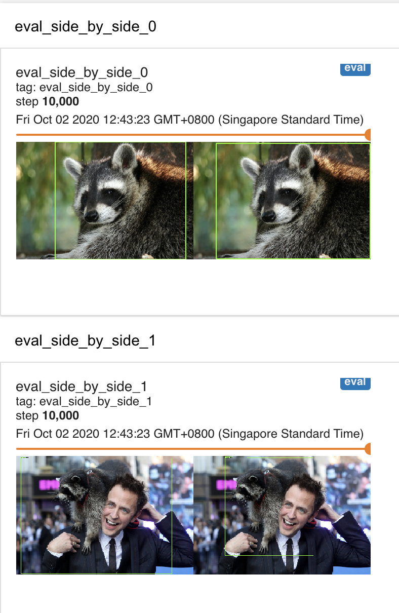

# Training a Custom Object Detector

Welcome to this week's hands-on lab. In this lab, we are going to learn how to train a raccoon detector! 

At the end of this exercise, you will be able to:

- create dataset in Tensorflow Records format (TFRecords) 
- use a pretrained model to shorten training time required for object detection 
- configure training pipeline of Tensorflow Object Detection API (TFOD API)
- train a custom object detector and monitor the training progress
- deploy the trained model for object detection 

***Pre-requisites***

You need to clone the object detection API into the VM.  Do the following:

```

cd ~/git
mkdir tensorflow 
cd tensorflow 
git clone https://github.com/tensorflow/models.git

```

***Note***

- Some familiarity with Linux shell command is required for this lab.
- If you are using the Cloud VM provided, the TFOD API and its required libraries has been installed
and configured. Make sure you use the ``tf2env`` conda environment 
- If you are running this on your own machine, make sure you have installed the TFOD API according to the 
[instructions](https://github.com/tensorflow/models/blob/master/research/object_detection/g3doc/tf2.md)
- You need to run this exercise using the correct conda environment that has all the prerequisite packages.
e.g. tf2env. 
- The commands below has to be typed out in a terminal (e.g. a bash terminal on Linux/MacOS machine, or 
command prompt in Windows)
- The referenced paths and the instructions below assumes you are using the Cloud VM provided.
- ``lab folder`` in the instructions below refers to the folder where this practical is located.

## Create the project folder structure

As we will be dealing with a lot of different files, it is important to have certain folder structure to organise all
the different files. Let's create the following folder structure:

In the home directory, e.g. /home/ubuntu, create the following folder structure:
```
raccoon_project
-data
 -images
 -annotations
-models
 -model
 -pretrained_model
 -export_model
```

The folders will be used for storing the files mentioned below:

- ``data/images``: the .jpg files for training and validation
- ``data/annotations``: the annotation files in .xml (Pascal VOC) format
- ``data/``: label mapping file (e.g raccoon_label_map.pbtxt) and TFRecords
- ``models/model``: all the training model checkpoints
- ``models/pretrained_model``: the pretrained model checkpoints (e.g. ssd-mobilenet-v2 model checkpoints)
- ``models``: training pipeline config file
- ``models/export_model``: contains the exported custom trained model

## Download the Training Data

Let's use an existing data set that is already annotated for this exercise. Clone the following to a directory on your local PC, or if on the cloud vm server, `cd` to /home/ubuntu/git and run the following:

```bash
git clone https://github.com/khengkok/raccoon_dataset.git
```

You will see the following two folders (among other folders)

```
raccoon_dataset
-annotations
-images
```

From the ``raccoon_datset/images`` directory, copy all the .jpg files (200 of them)  to `raccoon_project/data/images`. 

```
cp ~/git/raccoon_dataset/images/*  ~/raccoon_project/data/images/
```

From the ``raccoon_datset/annotations directory``, copy all the .xml files (200 of them)  to `raccoon_project/data/annotations`. 

```
cp ~/git/raccoon_dataset/annotations/*  ~/raccoon_project/data/annotations/
```

*Note:* In linux, the tilde sign `~` is just a shortcut to home folder, i.e /home/ubuntu in our case.
You can also collect your own images and annotate them using tools such as LabelImg. Refer to [LabelImg](https://github.com/tzutalin/labelImg)
for installation and usage instructions.

## Create Label Map

TFOD API requires a label map (.pbtxt) file, which contains mapping of the used labels to an integer values. This label map is used in both the training and detection processes. 

For example, if the dataset contains 2 labels, dogs and cats, then our label map file will have the following content:

```
item {
    id: 1
    name: 'cat'
}
item {
    id: 2
    name: 'dog'
}
```

Since we are detecting only 1 object (raccoon), there is only 1 label required for our .pbtxt file. 
An example file is already provided for you called `raccoon_label_map.pbtxt`. Open the file and examine it. 
Copy the label map file from your lab folder to the ``~/raccoon_project/data`` directory.

```
cp ~/git/sdaai-pdc2-students/iti107/session-5/od_custom_training/raccoon_label_map.pbtxt ~/raccoon_project/data/
```

 
## Creating TensorFlow Records

TFOD API requires the training/validation data to be stored as TF Records (binary) format. 
  
From the lab folder, run the following python script to convert the data (images and annotations) to TFRecords: 

``` bash
python create_raccoon_tf_record.py --data_dir ~/raccoon_project/data \
        --output_dir ~/raccoon_project/data \
        --label_map ~/raccoon_project/data/raccoon_label_map.pbtxt \
        --num_shards 1 \
        --test_ratio 0.2
```

You will see that two records created in the directory ~/raccoon_project/data e.g: 
raccoon_train.record-00000-of-00001, raccoon_test.record-00000-of-00001

**Note:** The `create_raccoon_tf_record.py` script assumes existence of two subdirectories: `images` and `annotations` under the specified `--data_dir` (e.g. ~/raccoon_project/data).  So if you are using different directory structure, you may need to modify the script to suite your directory structure. 


## Download pretrained model

Training a state of the art object detector from scratch can take days, even when using multiple GPUs!
In order to speed up training, we'll take an object detector that is pre-trained on a different dataset (COCO), and 
reuse some of it's parameters to initialize our new model. You can download the pre-trained model from Tensorflow model zoo. 

```
## Download the pre-trained model to your home directory
cd ~

wget http://download.tensorflow.org/models/object_detection/tf2/20200711/ssd_mobilenet_v2_320x320_coco17_tpu-8.tar.gz
    
## unzip the model.tar.gz file 
tar -xvf ssd_mobilenet_v2_320x320_coco17_tpu-8.tar.gz
```

You will see a folder called ``'ssd_mobilenet_v2_320x320_coco17_tpu-8'`` that contains folders called ``checkpoint`` and ``saved_model`` and also a pipeline.config file specific to this model. You can configure your training and evaluation by doing some setting in this file (see the next section how to configure this file).  

The checkpoint directory contains the checkpoints that we can use for training our custom model, with the names like ``ckpt-0.*``. 

The saved_model directory contains the SavedModel that we can use to do inference. This SavedModel can be loaded directly using ``tf.keras.models.load_model()``.

Copy all the contents inside the ``ssd_mobilenet_v2_320x320_coco17_tpu-8`` folder to ``raccoon_project/models/pretrained_model`` by: 

```
## do this inside the ssd_mobilenet_v2_320x320_coco17_tpu-8 folder
cp -r * ~/raccoon_project/models/pretrained_model/ 
```

You should see in two subfolders `checkpoint` and `saved_model` in the pretrained_model folder.

## Configure the Object Detection Pipeline

We will now configure the training pipeline for our object detector. Depending on which detector algorithm and the feature extractor you are using, the configuration will be different. To get started quickly, you can use the sample configuration available in the TFOD API directory:  `<tfod_api_install_root>/models/research/object_detection/samples/configs/tf2`. Here you can see different combinations of detector algorithm and the feature extractor, e.g. ssd_mobilenet_v2_xx.config is for SSD using MobileNetV2 as feature extractor. (Note: A pipeline.config file is also packaged together with the pretrained model you downloaded from model zoo, as mentioned above).  An adapted config file has been made available in your lab folder called `train_pipeline.config`.  

Open the `train_pipeline.config` file with an editor (e.g. `vi` or `nano` on Ubuntu) and modify those parameters that are marked: `<MODIFY THIS>`

```
model {
    ssd {
        num_classes: 1
    ...
}


train_config: {
  ...
  fine_tune_checkpoint: "/home/ubuntu/raccoon_project/models/pretrained_model/checkpoint/ckpt-0"
  ...
    
  fine_tune_checkpoint_type: "detection" # Set this to "detection" since we want to be training the full detection model
  use_bfloat16: false # Set this to false if you are not training on a TPU
}

train_input_reader: {
  label_map_path: "/home/ubuntu/raccoon_project/data/raccoon_label_map.pbtxt"
  tf_record_input_reader {
      input_path: "/home/ubuntu/raccoon_project/data/raccoon_train.record-00000-of-00001"
  }
}
...

eval_input_reader: {
  label_map_path: "/home/ubuntu/raccoon_project/data/raccoon_label_map.pbtxt"
  shuffle: false
  num_epochs: 1
  tf_record_input_reader {
     input_path: "/home/ubuntu/raccoon_project/data/raccoon_val.record-00000-of-00001"
  }
}
```

A completed sample file called `sample_pipeline.config` has been provided for you too. 
Use the sample if you do not want to modify the config file. Rename it as pipeline.config. 

Copy the pipeline.config file to ``raccoon_project/``.

If you want to find out more information on configuring the pipeline, please refer to [TFOD API documentation on pipeline](https://github.com/tensorflow/models/blob/master/research/object_detection/g3doc/configuring_jobs.md)
for more information.


## Start the training 

You can start the training by running `model_main2.py` from the directory 
`tensorflow/models/research directory`, and passing the various parameters such as config path, the directory to save the model checkpoints to, etc. 

**Note**: on the server the tensorflow directory is located at `/home/ubuntu/git`)

```
# From the tensorflow/models/research/ directory
PIPELINE_CONFIG_PATH=/home/ubuntu/raccoon_project/pipeline.config
MODEL_DIR=/home/ubuntu/raccoon_project/models/model
python /home/ubuntu/git/tensorflow/models/research/object_detection/model_main_tf2.py \
    --pipeline_config_path=${PIPELINE_CONFIG_PATH} \
    --model_dir=${MODEL_DIR} \
    --alsologtostderr
```

A script (`train.sh`) that contains the above has been created to avoid typing this repeatedly. Modify the script to change the PIPELINE_CONFIG and MODEL_DIR accordingly. Copy the modified `train.sh` script to `tensorflow/models/research` directory. To make the script executable, you need to do the following: 
```
chmod +x train.sh 
```

After the script is run, you may see a lot of warning messages and you can safely ignore those (most of them are due to deprecation warning). 
If everything goes smoothly, you will start seeing the following training output:


    
## Start the evaluation
    
To see how model performs on validation set, you need to run evaluation script separately (in the previous version, the tensorflow object detection team combined both the train and eval in single script, alternating between train and evaluation, so you only need to run one script). As the training process is already using up ALL the GPU memory, your eval script will complain about OOM (out-of-memory) error when evaluation script is trying to allocate tensors in the GPU. If you have multiple GPU on your machine, you can always direct the evaluation script to run on a separate GPU (e.g. by setting CUDA_VISIBLE_DEVICES='2' to target GPU 2) But in our case, we only have a single GPU. So one workaround is to force the eval script to run using CPU instead. 
    
- Open a new terminal
- Type `conda activate tf2env` to activate tf2env conda environment
- Type ``export CUDA_VISIBLE_DEVICES=""``
- Run eval.sh

What we are doing here is to tell the tensorflow that we don't have any CUDA-capable device to use, and it will fall back to using only CPU. 
    
Now it is time to grab your coffee, sit back and relax :)  

## Monitoring Training Progress with Tensorboard 

You can monitor progress of the training and eval jobs by running Tensorboard on your local machine:

Open another terminal and run the tensorboard and specify the model directory as logdir. 

``tensorboard --logdir=/home/ubuntu/raccoon_project/models/model``

Once Tensorboard is running, navigate to `<serverIP>:6006` from your favourite web browser. 
(if you are running this in the cloud VM, and accessing it from school computer, port 6006 is blocked. 
You should access it by using `https://<serverIP>/tensorboard`, using the reverse proxy we have setup on the cloud VM)

You should be able see various charts such as following (after training it for 5 to 10 minutes):


Here you can see the plots for the varios mAP metrics over the training steps, as well as the training loss, e.g the classification loss and regression loss.

You can also see the evaluation results on the images by selecting the `Images` tab. Here you can see a 
comparison of the ground truth bounding boxes (right) and the predicted bounding boxes (left). Initially you will see that the bounding boxes were not very accurately drawn and may have multiple detections. But as training progresses, the detection should get better and better. 

 


Note that there is also another loss called 'loss'. This is the total training loss, consisting loss from classification, regression, etc.


## Stop Training 

Your training can take quite a while (1 to 2 hours).
You can determine if you can stop the training by looking at the validation loss or mAP. If the validation loss has plateued out for a few epochs, you can probably stop the training. 

## Exporting the Tensorflow Graph

After your model has been trained, you should export the inference graph to a standard exported model folder structure (same as the model you downloaded from TF2 Model Zoo) so that it can be used later. We can use the script provided by the TFOD API, exporter_main_v2.py and supply the arguments such as the pipeline config file, checkpoint directory, etc. like the following:

```
PIPELINE_CONFIG_PATH=/home/ubuntu/raccoon_project/pipeline.config
MODEL_DIR=/home/ubuntu/raccoon_project/models/model
TRAIN_CHECKPOINT_DIR=/home/ubuntu/raccoon_project/models/model
EXPORT_DIR=/home/ubuntu/raccoon_project/models/export_model

python /home/ubuntu/git/tensorflow/models/research/object_detection/exporter_main_v2.py \
    --input_type image_tensor \
    --pipeline_config_path ${PIPELINE_CONFIG_PATH} \
    --trained_checkpoint_dir ${TRAIN_CHECKPOINT_DIR} \
    --output_directory ${EXPORT_DIR}
    
```

Before running the export script, make sure you have stopped the training process on the GPU (on a CPU, there is no need to stop), as it will make use of the same GPU memory that you are running your training process, and it will throw a out-of-memory error. 

A convenience script (`export.sh`) that contains the above has been created to avoid typing this repeatedly. 

Afterwards, you should see the following contents in `export_model`: 

```
- checkpoint 
  - checkpoint
  - ckpt.0.data-00000-of-00001
  - ckpt-0.index
- saved_model
  - assests
  - variables
  - saved_model.pb
pipeline.config 
```

However, in this new version of TFOD, exporter_main_v2.py only exports the latest checkpoint. However, we may want to export the earlier checkpoint, as the earlier checkpoint may have the best performance. One workaround is to modify the ``checkpoint`` file in the training checkpoint directory (e.g. ~/raccoon_project/models/model), and change the name to other checkpoint file name. 

For example, the ``checkpoint`` file may have the following original content: 

```

model_checkpoint_path: "ckpt-12"
all_model_checkpoint_paths: "ckpt-6"
all_model_checkpoint_paths: "ckpt-7"
all_model_checkpoint_paths: "ckpt-8"
all_model_checkpoint_paths: "ckpt-9"
all_model_checkpoint_paths: "ckpt-10"
all_model_checkpoint_paths: "ckpt-11"
all_model_checkpoint_paths: "ckpt-12"
all_model_checkpoint_timestamps: 1601611588.861176
all_model_checkpoint_timestamps: 1601612029.9504316
all_model_checkpoint_timestamps: 1601612471.713808
all_model_checkpoint_timestamps: 1601612913.4279857
all_model_checkpoint_timestamps: 1601613356.2644634
all_model_checkpoint_timestamps: 1601613798.8340204
all_model_checkpoint_timestamps: 1601614241.2990458
last_preserved_timestamp: 1601609353.4315968

```

The first line indicates the checkpoint filepath of the latest checkpoint, in this case ckpt-12. If we want to use ckpt-9 instead, then just change the first line to 'ckpt-9'. 

A note about the checkpoint number. In TFOD 2, the checkpoint number is no more representing the training step. It is just a running sequence number: a new number for a new checkpoint. So how do we know which checkpoint number to use? 

In this version of TFOD, during the training loop, a checkpoint is created every 1000 training steps. So just multiply the number with the 1000 to get the corresponding steps. You can control how frequent the checkpoint is created by passing in the argument ``--checkpoint_every_n``. 

## Test your custom model

Now you are ready to test your trained model. Run the provided notebook `od_custom_model.ipynb`  to run your raccoon detector!

### Using our pre-trained model 

We have already trained the raccoon detector on a GPU server. You can try out our trained model. Change directory to your home directory and download our models using: 

```
wget https://sdaai-bucket.s3-ap-southeast-1.amazonaws.com/pretrained-weights/iti107/session-5/export_model.tar.gz
tar -xvf export_model.tar.gz
```

After unzip and untar, you will see a folder *export_model*. In your codes, just change your path to point to the *saved_model* subfolder of the *export_model*